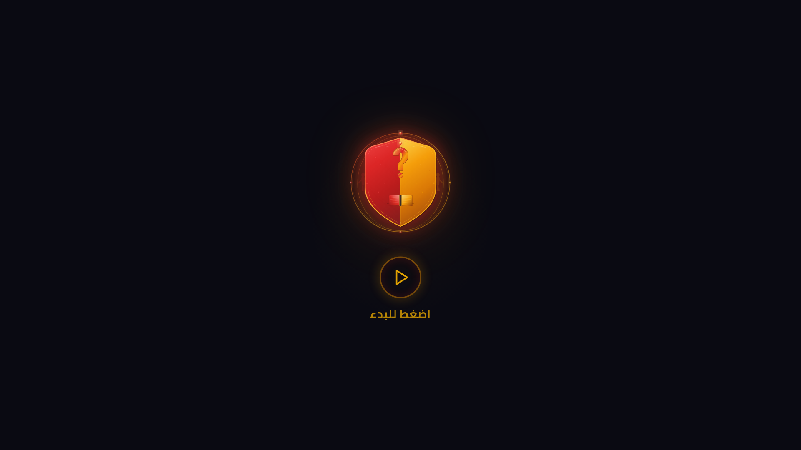

# ⚔️ معركة الأسئلة | Battle of Questions

[](LICENSE.md)
[]()
[](https://battle-of-questions.vercel.app)

> Multiplayer quiz battle game with real-time rooms, team modes & live scoring
> لعبة أسئلة تفاعلية متعددة اللاعبين مع غرف مباشرة وفرق



---

## 🌐 English

### Features

- ⚔️ **Real-time quiz battles** — Compete with other players live
- 🏠 **Public & private game rooms** — Create or join game rooms
- 👥 **Team mode & solo challenges** — 1v1 or team vs team challenges
- 📊 **Live scoring system** — Track your score in real time
- 🎯 **Multiple difficulty levels** — Easy, medium, and hard
- 📝 **Diverse question types** — Multiple choice, true/false, and more
- 🔊 **Sound effects** — Interactive audio and effects
- 🐳 **Docker support for deployment** — Easy containerized deployment
- 📱 **Responsive design** — Works on all devices
- 🌙 **Dark/Light mode** — Choose your preferred theme

### Game Modes

| Mode | Description |
|------|-------------|
| 🗡️ Solo Challenge | 1v1 quiz battle |
| ⚔️ Team Battle | Team vs team competition |
| 🎯 Custom | Customizable game settings |
| 📖 Answer Review | Review correct answers after game |

### Technologies

- Next.js, TypeScript, Socket.io, Tailwind CSS, shadcn/ui, Prisma, Framer Motion, Docker, Railway

### Installation

```bash
git clone https://github.com/ziadamr45/Battle-of-Questions.git
cd Battle-of-Questions
npm install
# Set up .env from .env.example
npx prisma migrate dev
npm run dev
```

#### Docker Deployment

```bash
docker build -t battle-of-questions .
docker run -p 3000:3000 battle-of-questions
# Or use the start script
./start-all.sh
```

### Live Demo

[battle-of-questions.vercel.app](https://battle-of-questions.vercel.app)

### Contributing

See [CONTRIBUTING.md](CONTRIBUTING.md)

### License

This project uses [Source Available License](LICENSE.md) — © 2026 Ziad Amr

---

## 🇪🇬 العربية

### المميزات

- ⚔️ **معارك أسئلة في الوقت الحقيقي** — تنافس مع لاعبين آخرين مباشرة
- 🏠 **غرف لعب عامة وخاصة** — أنشئ أو انضم لغرف اللعب
- 👥 **وضع الفرق والتحديات الفردية** — تحديات 1 ضد 1 أو فرق ضد فرق
- 📊 **نظام تسجيل نقاط مباشر** — تابع نقاطك في الوقت الحقيقي
- 🎯 **مستويات صعوبة متعددة** — سهل، متوسط، وصعب
- 📝 **أنواع أسئلة متنوعة** — اختيار من متعدد، صح/خطأ، والمزيد
- 🔊 **مؤثرات صوتية** — أصوات وتأثيرات تفاعلية
- 🐳 **دعم Docker للنشر** — نشر سهل باستخدام الحاويات
- 📱 **تصميم متجاوب** — يعمل على جميع الأجهزة
- 🌙 **وضع داكن/فاتح** — اختر المظهر المناسب لك

### أوضاع اللعب

| الوضع | الوصف |
|-------|-------|
| 🗡️ تحدي فردي | معركة أسئلة 1 ضد 1 |
| ⚔️ معركة فرق | منافسة فريق ضد فريق |
| 🎯 مخصص | إعدادات لعب قابلة للتخصيص |
| 📖 مراجعة الإجابات | مراجعة الإجابات الصحيحة بعد اللعبة |

### التقنيات

- Next.js، TypeScript، Socket.io، Tailwind CSS، shadcn/ui، Prisma، Framer Motion، Docker، Railway

### التثبيت

```bash
git clone https://github.com/ziadamr45/Battle-of-Questions.git
cd Battle-of-Questions
npm install
# إعداد .env من .env.example
npx prisma migrate dev
npm run dev
```

#### النشر باستخدام Docker

```bash
docker build -t battle-of-questions .
docker run -p 3000:3000 battle-of-questions
# أو استخدم سكربت التشغيل
./start-all.sh
```

### تجربة مباشرة

[battle-of-questions.vercel.app](https://battle-of-questions.vercel.app)

### المساهمة

راجع [CONTRIBUTING.md](CONTRIBUTING.md)

### الرخصة

هذا المشروع يستخدم [رخصة عرض المصدر](LICENSE.md) — © 2026 زياد عمرو

---

## Developer | المطور

**Ziad Amr** (زياد عمرو)

- 🌐 Portfolio: [ziadamrme.vercel.app](https://ziadamrme.vercel.app)
- 💼 GitHub: [github.com/ziadamr45](https://github.com/ziadamr45)
- 📘 Facebook: [facebook.com/ziad7mr](https://www.facebook.com/ziad7mr)
- 💬 Telegram: [t.me/ziadamr](https://t.me/ziadamr)
- 📸 Instagram: [instagram.com/ziadamr455](https://www.instagram.com/ziadamr455/)
- 🧵 Threads: [threads.com/@ziadamr455](https://www.threads.com/@ziadamr455)
- 🐦 X (Twitter): [x.com/ziad90216](https://x.com/ziad90216)
- 🎥 YouTube: [youtube.com/@alhayat_ala_eltarek](https://youtube.com/@alhayat_ala_eltarek)
- 💼 LinkedIn: [linkedin.com/in/ziad-amr-44633a411](https://www.linkedin.com/in/ziad-amr-44633a411)
- 📧 Email: ziad90216@gmail.com

---
<p align="center">
  Powered by <a href="https://github.com/ziadamr45">Ziad Amr</a>
</p>
